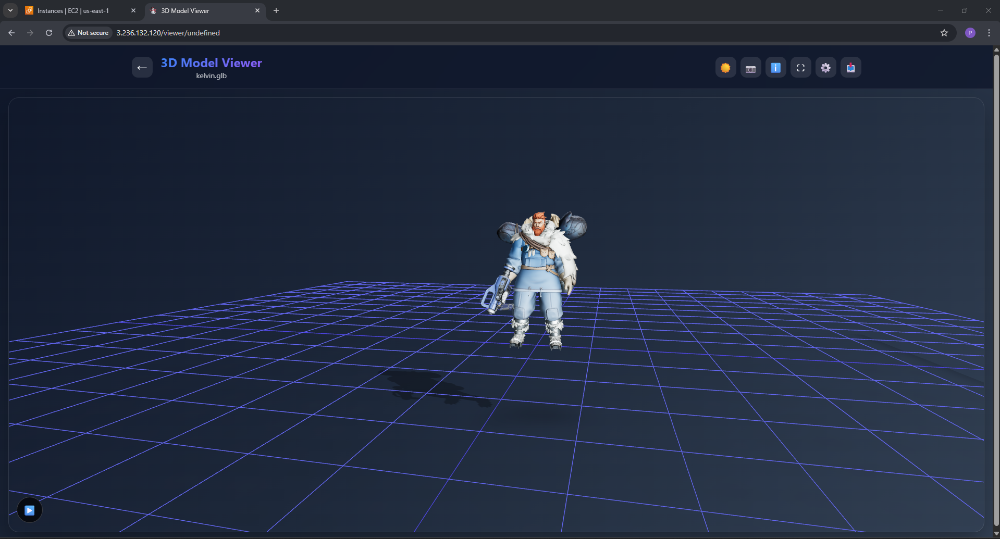
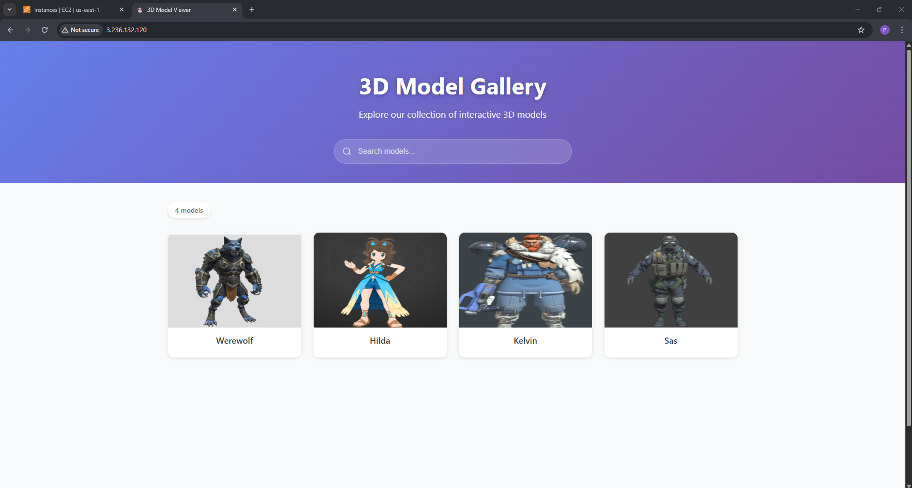

# 🌐 3D Model Viewer Web App with AWS, Docker, and Terraform 🚀

A full-stack web application that displays interactive 3D models, hosted securely on AWS using a scalable and modern architecture. The app features a React frontend, a Node.js backend API, Docker containerization, and infrastructure provisioned entirely using Terraform.

---

## 📸 Project Preview

<!-- Add demo screenshots or GIFs here -->

## 🧩 Project Architecture

**Frontend**  
- Built with React  
- Dockerized and served via **Nginx**  
- Hosted on a **public EC2 instance**  
- Uses `/api/models` endpoint to fetch model metadata from backend

**Backend**  
- Built with Node.js + Express  
- Connects to **AWS S3** to fetch list of models and thumbnails  
- Runs inside a **private EC2 instance**  
- Exposed only to frontend via **Nginx reverse proxy**

**Infrastructure**  
- Provisioned using **Terraform**  
- Includes:
  - VPC with public and private subnets
  - Internet Gateway and NAT Gateway
  - EC2 instances with Security Groups
  - S3 bucket for model storage

---

## 🗂️ Features

✅ Fetch & display 3D models stored in S3  
✅ React app with responsive UI  
✅ Secure backend in private subnet  
✅ Terraform-managed cloud infrastructure  
✅ Nginx proxy for safe API access  
✅ Dockerized for consistency and portability 

---
## 📦 Tech Stack

| Category       | Tools/Services                       |
|----------------|--------------------------------------|
| Frontend       | React, Nginx                         |
| Backend        | Node.js, Express, AWS SDK            |
| Cloud Platform | AWS EC2, S3, IAM                     |
| DevOps         | Docker, Terraform                    |
| Security       | Private subnet, SG rules, Env vars   |

---
## 📦 Prerequisites

- AWS account with an S3 bucket configured for model and image storage
- Terraform CLI
---

## 🚀 Deployment Instructions

1. **Clone the Repository**

2. **Deploy infrastructure using terraform**

3. **Add Environment File to Backend**

    Navigate to the backend/ directory and create a .env file with your AWS bucket name region and port

    `AWS_REGION=your-region`
    `S3_BUCKET=your-s3-bucket-name`
    `PORT=4000`

4. **Update Nginx Configuration**

    In the frontend/default.conf file, update the /api/ proxy to point to your backend EC2 instance’s private ip

    location /api/ {
    proxy_pass http://your-backend-private-ip:4000/;
    ...
    }

5. **Build Docker Images**

    Build both backend and frontend Docker images: 
    # Backend
    `cd backend`
    `docker build -t backend-app .`

    # Frontend
    `cd ../frontend`
    `docker build -t frontend-app .`

6. **Run Docker Containers**

    Start containers on their respective EC2 instances:

    # On backend EC2 (private)
    `docker run -d --name backend-container -p 4000:4000 --env-file .env backend-app`

    # On frontend EC2 (public)
    `docker run -d --name frontend-container -p 80:80 frontend-app`

